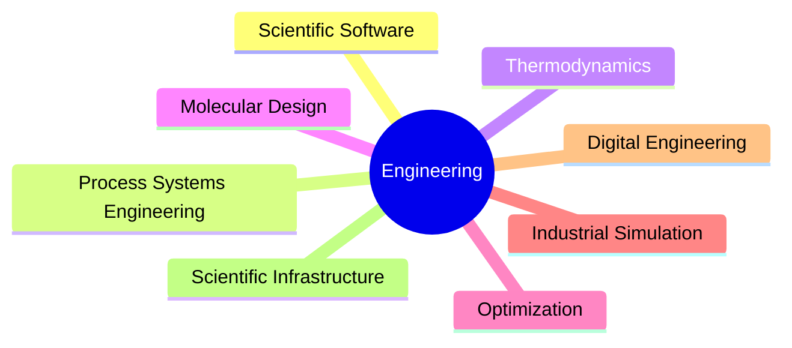

# ⚙️ Victor Roa

### Computational Process Systems Engineer

### Scientific Software · Thermodynamic Modeling · Industrial Process Simulation

---

<p align="center">
  
</p>

---

## 🧠 About me

I develop scientific and industrial software for representing, simulating, and optimizing complex chemical and energy systems.

My work integrates:

- thermodynamics
- process systems engineering
- scientific computing
- optimization
- molecular informatics
- engineering software architecture

to build computational systems capable of translating industrial and molecular-scale problems into structured and decision-oriented models.

---

# 🚀 Main Projects

## 🔷 MORITA

### Multi-Objective Resolution Interface Toted Up with Aromatics

Scientific framework for:

- Computer-Aided Molecular Design (CAMD)
- Liquid-Liquid Extraction systems
- Multi-objective optimization
- Thermodynamic modeling
- Molecular fragmentation workflows

### Integrated technologies

| Area                 | Technologies                               |
| -------------------- | ------------------------------------------ |
| Thermodynamics       | UNIFAC · UNIFAC-Dortmund                  |
| Molecular modeling   | RDKit · SMARTS                            |
| Optimization         | Evolutionary Algorithms · Pareto Analysis |
| GUI                  | Tkinter · MVC                             |
| Databases            | MongoDB                                    |
| Scientific Computing | NumPy · SciPy · pandas                   |

---

## 🏭 Industrial Process Simulation

Development of computational workflows for:

- Biodiesel facilities
- Heat-transfer systems
- Energy integration
- Process optimization
- Mass & energy balances
- Engineering-economic evaluation

### Toolchain

```text
Excel Interface
      ↓
 JSON Translation Layer
      ↓
Python Computational Engine
      ↓
Simulation & Optimization
      ↓
Automated Reporting
```

---

## 🧩 Scientific Software Architecture

I also work on:

- MVC architectures
- Scientific GUI systems
- Engineering workflow automation
- Modular simulation engines
- Computational infrastructure for engineering applications

---

# 🛠️ Computational Profile

<div align="center">

| Domain                 | Stack                                                   |
| ---------------------- | ------------------------------------------------------- |
| Scientific Programming | Python · MATLAB · R · SQL                            |
| Scientific Computing   | NumPy · SciPy · pandas                                |
| Process Simulation     | Aspen Plus · Aspen Hysys · DWSIM                     |
| Molecular Informatics  | RDKit · SMARTS                                         |
| Optimization           | Multi-objective Optimization · Evolutionary Algorithms |
| Software Engineering   | MVC · Modular Architectures                            |
| Data Engineering       | MongoDB · Excel Automation                             |

</div>

---

# 📊 Engineering Interests



---

# 📈 GitHub Analytics

<p align="center">
  


</p>

---

# 🔬 Research & Technical Interests

- Computational Thermodynamics
- Scientific Software Engineering
- Industrial AI-assisted Engineering
- Optimization-driven Process Design
- Process Systems Engineering
- Molecular Design Frameworks
- Engineering Workflow Automation

---

# 🌐 Connect

<p align="left">

<a href="https://github.com/TU_USUARIO">
  
</a>

<a href="https://linkedin.com/in/TU_LINKEDIN">
  
</a>

<a href="mailto:victoroa.13@gmail.com">
  
</a>

</p>

---

# ⚡ Philosophy

> Engineering models should not only compute correctly —
> they should preserve structure, expose assumptions,
> and support technically rigorous decision-making.
>
