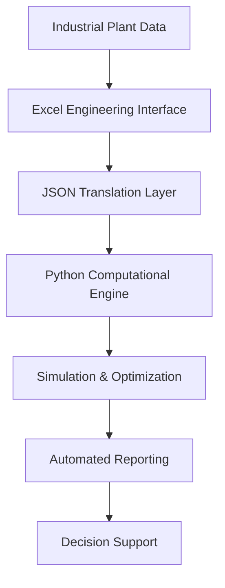
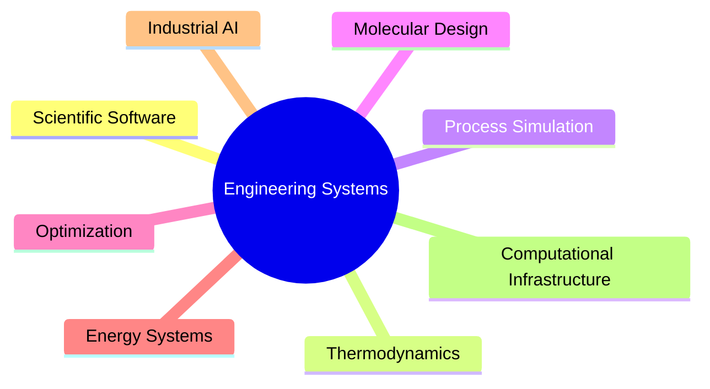

# ⚙️ Victor Roa

### Computational Process Systems Engineer  
### Scientific Software Architect · Thermodynamic Modeling · Industrial Simulation

---

  

---

---

# 🧠 Computational Engineering Philosophy

I develop computational systems for representing, simulating, and optimizing complex engineering processes across molecular, thermodynamic, and industrial scales.

My work combines:

- process systems engineering
- scientific computing
- thermodynamic modeling
- optimization theory
- molecular informatics
- engineering software architecture

to create engineering-oriented computational infrastructures that preserve scientific structure while supporting industrial decision-making.

Rather than treating engineering models as isolated calculations, I focus on building integrated systems where physical assumptions, optimization logic, computational workflows, and software architecture remain explicitly connected.

---

# 🚀 Core Systems

---

## 🔷 MORITA  
### *Multi-Objective Resolution Interface Toted Up with Aromatics*

> Scientific framework for computer-aided molecular and solvent design (CAMD)

MORITA integrates:

- UNIFAC / UNIFAC-Dortmund thermodynamic models
- SMARTS-based molecular fragmentation
- multi-objective optimization
- Pareto-front analysis
- molecular database workflows
- engineering-oriented GUI systems
- computational decision-support architectures

---

### MORITA Computational Pipeline

---

## 🏭 Industrial Process Simulation & Energy Systems

Development of simulation-oriented computational frameworks for:

- biodiesel production plants
- thermal integration systems
- mass & energy balance analysis
- process optimization
- industrial energy evaluation
- engineering-economic analysis

---

### Engineering Workflow Architecture

---

## 🧩 Scientific Software Infrastructure

I also work on the development of computational infrastructure for engineering applications, including:

- MVC-based scientific architectures
- modular simulation engines
- scientific GUI systems
- engineering workflow automation
- data-processing pipelines
- scientific visualization systems
- computational engineering interfaces

A major focus of my work is designing software systems that remain extensible, interpretable, and technically rigorous under increasing engineering complexity.

---

# 🛠️ Computational Stack

| Domain | Technologies |
|---|---|
| Scientific Programming | Python · MATLAB · R · SQL · Bash |
| Scientific Computing | NumPy · SciPy · pandas |
| Thermodynamics | UNIFAC · UNIFAC-Dortmund · Phase Equilibrium |
| Process Simulation | Aspen Plus · HYSYS · DWSIM |
| Molecular Informatics | RDKit · SMARTS · Group Contribution Methods |
| Optimization | Multi-objective Optimization · Evolutionary Algorithms |
| Software Architecture | MVC · Modular Systems · GUI Engineering |
| Data Infrastructure | MongoDB · Excel Automation · JSON Pipelines |

---

# 📊 Computational Domains

---

# 📈 GitHub Analytics

---

# 🔬 Research & Technical Interests

- Scientific Software Engineering
- Computational Thermodynamics
- Process Systems Engineering
- Optimization-Driven Process Design
- Industrial AI-assisted Engineering
- Engineering Decision-Support Systems
- Computer-Aided Molecular Design
- Scientific Workflow Automation
- Computational Infrastructure for Engineering

---

# 🌐 Connect

---

# ⚡ Engineering Perspective

> Engineering software should not merely automate calculations.  
> It should expose assumptions, preserve structure, support reasoning,  
> and transform complex systems into interpretable computational models.

---

### Building computational infrastructure for engineering systems.

