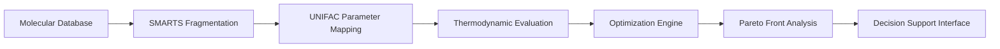
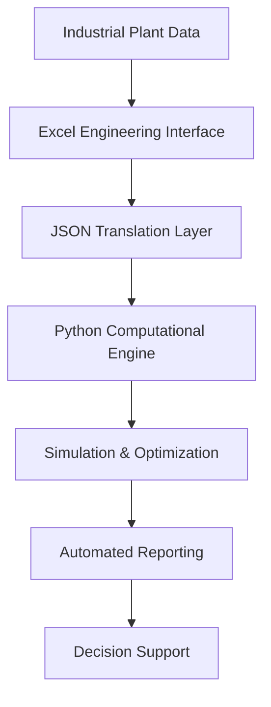
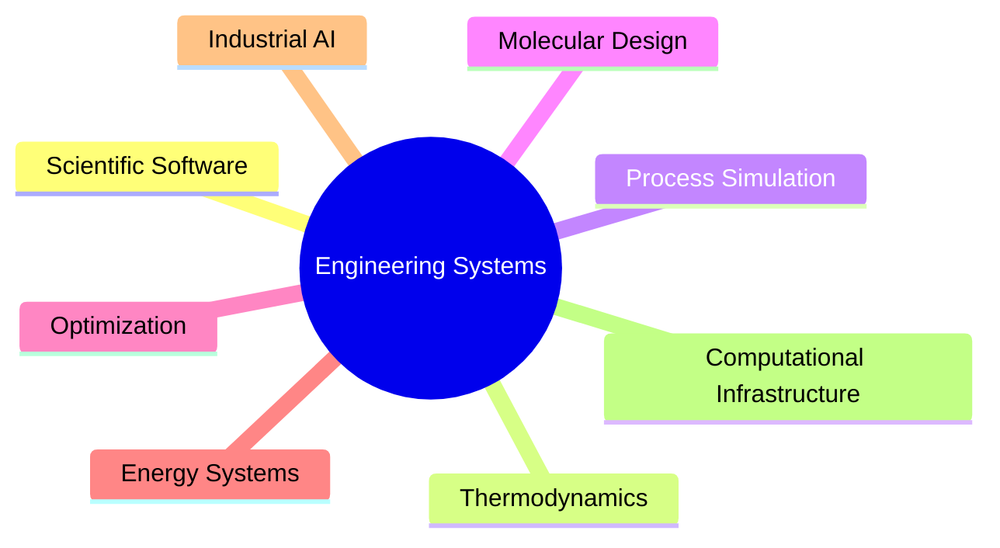

# ⚙️ Victor Roa

### Computational Process Systems Engineer  
### Scientific Software Architect · Thermodynamic Modeling · Industrial Simulation

---

  

---

---

# 🧠 Computational Engineering Philosophy

I develop computational systems for representing, simulating, and optimizing complex engineering processes across molecular, thermodynamic, and industrial scales.

My work combines:

- process systems engineering
- scientific computing
- thermodynamic modeling
- optimization theory
- molecular informatics
- engineering software architecture

to create engineering-oriented computational infrastructures that preserve scientific structure while supporting industrial decision-making.

Rather than treating engineering models as isolated calculations, I focus on building integrated systems where physical assumptions, optimization logic, computational workflows, and software architecture remain explicitly connected.

---

# 🚀 Core Systems

---

## 🔷 MORITA  
### *Multi-Objective Resolution Interface Toted Up with Aromatics*

> Scientific framework for computer-aided molecular and solvent design (CAMD)

MORITA is my flagship scientific software project: a computational framework for computer-aided molecular and solvent design (CAMD) focused on liquid-liquid extraction systems and multi-objective optimization.

The platform integrates:

- UNIFAC / UNIFAC-Dortmund thermodynamic models
- Group contribution methods
- Molecular fragmentation workflows using SMARTS/RDKit
- Multi-objective optimization strategies
- Pareto-front analysis
- Molecular database integration
- Scientific GUI architectures in Python

The system was designed to translate molecular design problems into explicit optimization structures balancing selectivity, partition performance, solvent loss, environmental impact, and process feasibility.

---

### MORITA Computational Pipeline

---

## 🏭 Industrial Process Simulation & Energy Systems

I also develop simulation-oriented workflows for industrial facilities involving:

- mass and energy balances
- heat-transfer systems
- biodiesel production plants
- thermal integration
- process optimization
- operational engineering analysis

These projects combine:

- Aspen Plus / HYSYS interoperability
- Python-based computational engines
- Excel-driven engineering interfaces
- automated reporting systems
- engineering-economic evaluation frameworks

The objective is not only simulation itself, but the creation of computational decision-support environments for industrial engineering.

---

### Engineering Workflow Architecture

---

## 🧩 Scientific Software Infrastructure

Beyond numerical modeling, I work on scientific software infrastructure:

- MVC architectures for engineering applications
- Tkinter-based scientific GUIs
- modular simulation engines
- engineering workflow automation
- scientific data pipelines
- engineering visualization systems
- simulation-oriented software design

A major focus of my work is making scientific models operationally usable while preserving technical rigor and extensibility.

---

# 🛠️ Computational Stack

| Domain | Technologies |
|---|---|
| Scientific Programming | Python · MATLAB · R · SQL · Bash · Git |
| Scientific Computing | NumPy · SciPy · Pandas · Numerical Optimization · Matrix Methods · Nonlinear Systems |
| Thermodynamic modeling | UNIFAC · UNIFAC-Dortmund · activity coefficient models · Phase Equilibrium · LLE Modeling |
| Optimization modeling | Multi-objective optimization · Pareto analysis · Evolutionary Algorithms |
| Process Simulation | Aspen Plus · HYSYS · DWSIM · Process Integration · Energy Analysis |
| Molecular Informatics | RDKit · SMARTS Fragmentation · Group Contribution Systems · Molecular Representation Workflows |
| Software Architecture | MVC Design · Scientific GUI Development · Modular Engineering Software · GUI Engineering |
| Engineering Systems | Industrial Process Analysis, Operational Modeling, Heat-Transfer Systems, Techno-Economic Workflows |
| Data Infrastructure | MongoDB · Excel Automation · JSON Pipelines |

---

# 📊 Computational Domains

---

# 📈 GitHub Analytics

---

# 🔬 Research & Technical Interests

- Scientific Software Engineering
- Computational Thermodynamics
- Process Systems Engineering
- Optimization-Driven Process Design
- Industrial AI-assisted Engineering
- Engineering Decision-Support Systems
- Computer-Aided Molecular Design
- Scientific Workflow Automation
- Computational Infrastructure for Engineering

My long-term goal is to build computational platforms that bridge scientific rigor, industrial applicability, and scalable engineering software.

---

# 🌐 Connect

---

# ⚡ Engineering Perspective

> Engineering software should not merely automate calculations.  
> It should expose assumptions, preserve structure, support reasoning,  
> and transform complex systems into interpretable computational models.

---

### Building computational infrastructure for engineering systems.

